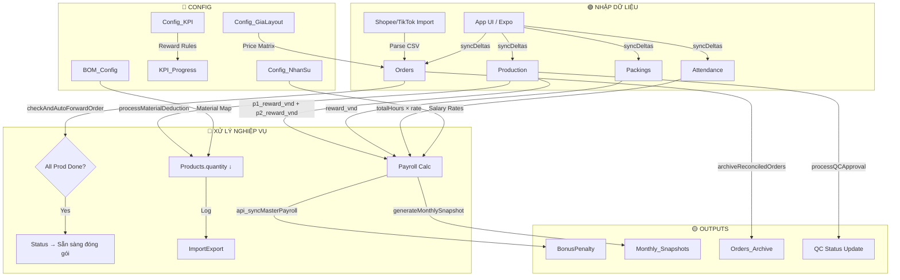

# Thẩm Định & Tối Ưu Hóa Cơ Sở Dữ Liệu RF_Workspace_Pro

## Tổng Quan

Phân tích toàn diện hệ thống CSDL Google Sheets 25 bảng của RF_Workspace_Pro — phát hiện **9 rủi ro ẩn giấu**, **6 điểm nghẽn hiệu năng**, và đề xuất **12 hành động tối ưu hóa** cụ thể.

---

## Bước 1 — THẨM ĐỊNH DỮ LIỆU (Data Audit)

### 1.1. Kiến trúc hiện tại: Dual-Schema Split

Hệ thống chia dữ liệu thành **2 khối schema riêng biệt** trong [Code.js](file:///c:/Users/ADMIN/RF_Workspace_Pro/Code.js#L1-L33):

| Khối | Biến | Số bảng | Mục đích |
|------|-------|---------|----------|
| **SCHEMA** | `var SCHEMA` (L1–L14) | 13 bảng | Vận hành core: Orders, Production, Packings, Attendance, Documents... |
| **SCHEMA_ERP** | `var SCHEMA_ERP` (L16–L33) | 16 bảng | Tài chính & kho: Products, Transactions, BOM_Config, KPI_Progress, PurchasedServices... |

> [!IMPORTANT]
> **Phát hiện #1: Schema thực tế = 25 bảng**, không phải 23 bảng như System Prompt ghi nhận. Có **2 bảng mới** chưa được cập nhật vào tài liệu:
> - `PurchasedServices` — quản lý dịch vụ đã mua (hóa đơn, thuế, ngày hết hạn)
> - `ThongKe_TichLuyXu` — hệ thống tích xu reward cho nhân viên
> - `Workspaces` — quản lý công cụ/bàn làm việc nhân sự
> - `Orders_Archive` — bảng lưu trữ đơn cũ (đã reconcile)

### 1.2. Sơ đồ luồng dữ liệu (Data Flow)



### 1.3. Phát hiện rủi ro ẩn giấu (Hidden Risks)

#### 🔴 RỦI RO NGHIÊM TRỌNG (P0)

| # | Rủi ro | Vị trí | Root Cause | Hậu quả |
|---|--------|--------|------------|---------|
| **R1** | **readSheet hard-cap 4000 dòng** | [Code.js L1049](file:///c:/Users/ADMIN/RF_Workspace_Pro/Code.js#L1049) | `var maxRows = 4000;` — khi bảng Orders/Production vượt 4000 dòng, chỉ đọc 4000 dòng cuối | **Mất dữ liệu ngầm** — các đơn hàng cũ bị cắt khỏi kết quả readSheet mà không có cảnh báo. Ảnh hưởng trực tiếp đến tính chính xác của `archiveReconciledOrders`, `getArchivedOrders` |
| **R2** | **Duplicate code lương: 2 bản copy** | [Code.js L597-840](file:///c:/Users/ADMIN/RF_Workspace_Pro/Code.js#L597-L840) vs [L856-1033](file:///c:/Users/ADMIN/RF_Workspace_Pro/Code.js#L856-L1033) | `api_syncMasterPayroll` và `generateMonthlySnapshot` chứa **logic tính lương gần giống nhau** (700→730 dup code) | Khi sửa công thức lương ở 1 nơi mà quên nơi kia → **sai số lương nghiêm trọng** |
| **R3** | **Trạng thái Unicode inconsistency** | [Code.js L434-436](file:///c:/Users/ADMIN/RF_Workspace_Pro/Code.js#L434-L436) | Hệ thống compare status dùng 6+ biến thể Unicode cho "Hủy" (HỦY, HUỶ, ĐÃ HỦY, ĐÃ HUỶ, HỦY/VỠ...) — **không có normalizer trung tâm** | Đơn bị bỏ sót hoặc xử lý sai khi trạng thái nhập từ nguồn khác (TikTok vs Shopee) |

#### 🟠 RỦI RO TRUNG BÌNH (P1)

| # | Rủi ro | Vị trí | Mô tả |
|---|--------|--------|-------|
| **R4** | `Config_NhanSu` fallback tên cột không khớp | [Operations.js L29-31](file:///c:/Users/ADMIN/RF_Workspace_Pro/Operations.js#L29-L31) | Tìm `'Họ và Tên'` / `'Tên Nhân Viên'` / `'user'` — nhưng SCHEMA thực tế là `'Tên Nhân Sự'`. Sẽ luôn trả -1 → crash khi gọi `api_generateMonthlyKPI_All` |
| **R5** | `Monthly_Snapshots` xuất hiện ở CẢ 2 schema | SCHEMA (L11) + SCHEMA_ERP (L27) | Duplicate definition. `initDB()` và `initDbERP()` đều cố tạo sheet này → race condition khi chạy lần đầu |
| **R6** | Ghost Orders filter quá mỏng | [Code.js L1198](file:///c:/Users/ADMIN/RF_Workspace_Pro/Code.js#L1198) | Chỉ lọc `customer === '0'`. Nếu ARRAYFORMULA tạo ghost row với customer = "" (rỗng), ghost vẫn lọt qua |

#### 🟡 RỦI RO THẤP (P2)

| # | Rủi ro | Mô tả |
|---|--------|-------|
| **R7** | `readSheet` Date parsing 1899 edge case | Khi ô chứa thời gian thuần `00:00:00`, hệ thống trả `""` thay vì `"00:00:00"` — gây mất data |
| **R8** | `getAppData` migration one-time flag không versioned | Property `'MIGRATION_V2_10_6_DONE'` sẽ chặn mọi migration tương lai nếu quên đổi tên flag |
| **R9** | `calculateBusinessHoursSLA` không trừ giờ trưa | Tính SLA 8AM–17PM liên tục, không trừ 12–13h nghỉ trưa → SLA thực tế bị tính thiếu ~60 phút/ngày |

### 1.4. Điểm nghẽn hiệu năng (Performance Bottlenecks)

| # | Điểm nghẽn | Impact | Giải pháp |
|---|-----------|--------|-----------|
| **B1** | `getAppData` đọc **toàn bộ 25 bảng** mỗi lần load app | O(N) × 25 sheet reads = ~8-15s load time | Lazy-load ERP tables, chỉ đọc 5 bảng core ban đầu |
| **B2** | `readSheet` parse **mỗi ô thành Date** rồi format lại String | O(rows × cols) Date operations | Batch-read với `getDisplayValues()` cho các cột date thay vì `getValues()` + manual format |
| **B3** | `archiveReconciledOrders` quét toàn bộ Orders từ dưới lên | Full-table scan mỗi lần archive | Thêm index column `archivedAt` hoặc sort by date desc |
| **B4** | Payroll calc (`api_syncMasterPayroll`) đọc 5 bảng cùng lúc | 5 × readSheet → 5 API calls × latency | Cache cross-table data trong CacheService (6h TTL) |
| **B5** | `syncDeltas` không batch — ghi từng dòng một | O(N) sheet writes per delta | Batch writes với `setValues()` — đã có nhưng không nhất quán |
| **B6** | Missing sheet-level indexing | Tìm kiếm theo ID luôn là O(N) linear scan | Tạo `ScriptProperties`-based ID index cho Orders và Production |

---

## Bước 2 — TÁI CẤU TRÚC & QUY HOẠCH (Restructuring)

### 2.1. Đề xuất hợp nhất Schema

```diff
- var SCHEMA = { ... 13 tables ... };
- var SCHEMA_ERP = { ... 16 tables ... };
+ var SCHEMA_ALL = {
+   // === CORE OPERATIONS ===
+   Orders: [...],
+   Orders_Archive: [...],
+   Production: [...],
+   Packings: [...],
+   
+   // === HUMAN RESOURCES ===
+   Config_NhanSu: [...],
+   Attendance: [...],
+   KPI_Progress: [...],
+   Config_KPI: [...],
+   Monthly_Snapshots: [...],   // ← Xóa duplicate
+   BonusPenalty: [...],
+   
+   // === FINANCE & INVENTORY ===
+   Products: [...],
+   Accounts: [...],
+   Transactions: [...],
+   ImportExport: [...],
+   Suppliers: [...],
+   ProfitReports: [...],
+   BOM_Config: [...],
+   PurchasedServices: [...],
+   CTV_Finance: [...],
+   Config_GiaLayout: [...],
+   
+   // === KNOWLEDGE & TOOLS ===
+   Documents: [...],
+   Trainings: [...],
+   Models3D: [...],
+   Reimbursements: [...],
+   ThongKe_TichLuyXu: [...],
+   Workspaces: [...],
+   Tracking_Log: [...]
+ };
```

### 2.2. Chuẩn hóa Status Normalizer (Central)

```javascript
// Hàm chuẩn hóa trạng thái — DUY NHẤT 1 NƠI trong hệ thống
function normalizeStatus(rawStatus) {
  var s = String(rawStatus || '').trim()
    .normalize('NFC')           // Chuẩn hóa Unicode
    .toUpperCase()
    .replace(/\s+/g, ' ');      // Xóa khoảng trắng thừa
  
  var STATUS_MAP = {
    'HOÀN THÀNH': 'Đối Soát Thành Công',
    'COMPLETED': 'Đối Soát Thành Công',
    'ĐÃ GIAO': 'Đã Bàn Giao',
    'DELIVERED': 'Đã Bàn Giao',
    'TRẢ HÀNG/HOÀN TIỀN': 'Hàng Hoàn',
    'RETURNED': 'Hàng Hoàn',
    'ĐÃ HỦY': 'Đơn Huỷ',
    'ĐÃ HUỶ': 'Đơn Huỷ',
    'CANCELLED': 'Đơn Huỷ',
    'HỦY': 'Đơn Huỷ',
    'HUỶ': 'Đơn Huỷ',
    'HỦY/VỠ': 'Đơn Huỷ',
    'HUỶ/VỠ': 'Đơn Huỷ',
    'HỦY / VỠ': 'Đơn Huỷ',
    'HUỶ / VỠ': 'Đơn Huỷ',
    'DONE': 'Done',
    'ĐÃ XONG': 'Done',
    'HOÀN KHO ĐẠT': 'Done'
  };
  
  return STATUS_MAP[s] || rawStatus;
}
```

### 2.3. Chuẩn hóa cột `Config_NhanSu`

```diff
// Operations.js L29-31 — FIX: Dùng đúng tên cột từ SCHEMA
- var nameCol = hrHeaders.indexOf('Họ và Tên');
- if (nameCol === -1) nameCol = hrHeaders.indexOf('Tên Nhân Viên');
- if (nameCol === -1) nameCol = hrHeaders.indexOf('user');
+ var nameCol = hrHeaders.indexOf('Tên Nhân Sự');
+ if (nameCol === -1) nameCol = hrHeaders.indexOf('Họ và Tên'); // Legacy fallback
```

### 2.4. Tách logic tính lương thành hàm dùng chung (DRY)

```javascript
/**
 * Core Payroll Calculator — single source of truth
 * Dùng chung cho cả api_syncMasterPayroll và generateMonthlySnapshot
 */
function calculatePayrollForUser(u, monthStr, options) {
  var salConfig = options.salConfig || {};
  var prodData = options.prodData || [];
  var packData = options.packData || [];
  var attData = options.attData || [];
  var bpData = options.bpData || [];
  var kpiData = options.kpiData || [];
  var prevDebt = options.prevDebt || 0;
  
  // ... (toàn bộ logic tính lương tập trung tại đây)
  // Trả về object payroll đầy đủ
}
```

---

## Bước 3 — TỐI ƯU HÓA & TỰ ĐỘNG HÓA (Automation)

### 3.1. Nâng cấp readSheet: Xóa hard-cap 4000 dòng

```javascript
function readSheet(name, filterFn, ss) {
  try {
    var activeSs = ss || SpreadsheetApp.getActiveSpreadsheet();
    var sheet = activeSs.getSheetByName(name);
    if (!sheet) return [];
    var lastRow = sheet.getLastRow();
    if (lastRow <= 1) return [];

    // UPGRADE: Đọc toàn bộ data, không cap
    // Nếu cần giới hạn, dùng filterFn để lọc tại application layer
    var data = sheet.getRange(1, 1, lastRow, sheet.getLastColumn()).getValues();
    var headers = data[0];
    // ... (phần còn lại giữ nguyên)
  }
}
```

> [!WARNING]
> **Rủi ro**: Bảng Orders nếu vượt 10,000 dòng sẽ gây timeout 30s của Apps Script. Giải pháp: **Archive** đơn cũ định kỳ (đã có `archiveReconciledOrders`) + giữ Orders lean ≤3000 dòng.

### 3.2. Auto-Archive Trigger (Tự động)

```javascript
/**
 * Trigger chạy hàng đêm lúc 2:00 AM
 * Tự động chuyển đơn đã đối soát >60 ngày sang Orders_Archive
 */
function setupNightlyArchiveTrigger() {
  // Xóa trigger cũ nếu có
  var triggers = ScriptApp.getProjectTriggers();
  triggers.forEach(function(t) {
    if (t.getHandlerFunction() === 'nightlyAutoArchive') {
      ScriptApp.deleteTrigger(t);
    }
  });
  
  ScriptApp.newTrigger('nightlyAutoArchive')
    .timeBased()
    .atHour(2)
    .everyDays(1)
    .create();
}

function nightlyAutoArchive() {
  var lock = LockService.getScriptLock();
  try {
    lock.waitLock(15000);
    var result = archiveReconciledOrders(60, null); // Bypass PIN cho auto-trigger
    Logger.log('Auto-Archive: ' + JSON.stringify(result));
  } catch (e) {
    Logger.log('Auto-Archive Error: ' + e.toString());
  } finally {
    lock.releaseLock();
  }
}
```

### 3.3. Data Integrity Validator (Health Check)

```javascript
/**
 * Quét toàn bộ CSDL, phát hiện anomalies
 * Chạy định kỳ hoặc theo yêu cầu
 */
function api_runDataIntegrityCheck() {
  var ss = SpreadsheetApp.getActiveSpreadsheet();
  var issues = [];
  
  // CHECK 1: Orphan Productions (orderId không tồn tại trong Orders)
  var orderIds = {};
  readSheet('Orders', null, ss).forEach(function(o) { orderIds[o.id] = true; });
  readSheet('Production', null, ss).forEach(function(p) {
    if (p.orderId && !orderIds[p.orderId]) {
      issues.push({
        severity: 'WARNING',
        table: 'Production',
        id: p.id,
        message: 'Lệnh sản xuất mồ côi — orderId "' + p.orderId + '" không tồn tại trong Orders'
      });
    }
  });
  
  // CHECK 2: Duplicate IDs
  ['Orders', 'Production', 'Packings', 'Products'].forEach(function(tableName) {
    var seen = {};
    readSheet(tableName, null, ss).forEach(function(row) {
      if (seen[row.id]) {
        issues.push({
          severity: 'ERROR',
          table: tableName,
          id: row.id,
          message: 'ID trùng lặp'
        });
      }
      seen[row.id] = true;
    });
  });
  
  // CHECK 3: Schema drift (cột thực tế vs SCHEMA definition)
  var allSchemas = Object.assign({}, SCHEMA, SCHEMA_ERP);
  Object.keys(allSchemas).forEach(function(sheetName) {
    var sheet = ss.getSheetByName(sheetName);
    if (!sheet) {
      issues.push({ severity: 'ERROR', table: sheetName, message: 'Sheet không tồn tại!' });
      return;
    }
    var actualHeaders = sheet.getRange(1, 1, 1, sheet.getLastColumn()).getValues()[0]
      .map(function(h) { return String(h).trim(); })
      .filter(function(h) { return h.length > 0; });
    var expectedHeaders = allSchemas[sheetName];
    
    expectedHeaders.forEach(function(col) {
      if (actualHeaders.indexOf(col) === -1) {
        issues.push({
          severity: 'WARNING',
          table: sheetName,
          message: 'Thiếu cột "' + col + '" theo schema definition'
        });
      }
    });
  });
  
  // CHECK 4: Negative Product quantities
  readSheet('Products', null, ss).forEach(function(p) {
    if (Number(p.quantity) < 0) {
      issues.push({
        severity: 'ERROR',
        table: 'Products',
        id: p.id,
        message: 'SKU "' + p.sku + '" có tồn kho ÂM: ' + p.quantity
      });
    }
  });
  
  return {
    success: true,
    totalIssues: issues.length,
    errors: issues.filter(function(i) { return i.severity === 'ERROR'; }),
    warnings: issues.filter(function(i) { return i.severity === 'WARNING'; }),
    timestamp: new Date().toISOString()
  };
}
```

---

## Bước 4 — YẾU TỐ ĐỘT PHÁ (Wow Factor)

### 4.1. Real-time Data Lineage Dashboard

Tạo một endpoint `api_getDataLineage` trả về sơ đồ quan hệ giữa các bảng, giúp người quản trị nhìn thấy **bất kỳ thay đổi nào** ở bảng A sẽ ảnh hưởng bảng B, C, D qua luồng nào.

### 4.2. Schema Version Control

```javascript
// Ghi lại mọi thay đổi schema vào Tracking_Log
function logSchemaChange(tableName, action, details) {
  var ss = SpreadsheetApp.getActiveSpreadsheet();
  var logSheet = ss.getSheetByName('Tracking_Log');
  if (!logSheet) return;
  logSheet.appendRow([
    new Date().toISOString(),
    'SYSTEM',
    'Schema Change: ' + tableName + ' — ' + action,
    '',
    JSON.stringify(details)
  ]);
}
```

---

## Open Questions — Cần làm rõ trước khi thực thi

> [!IMPORTANT]
> **Câu 1**: Bảng `Orders` hiện tại có bao nhiêu dòng? Nếu >4000, hệ thống đang **mất dữ liệu ngầm** do hard-cap `readSheet` — cần xử lý khẩn cấp.

> [!IMPORTANT]
> **Câu 2**: Bạn muốn tôi thực thi phương án nào trước?
> - **A)** Fix ngay R1 + R4 (lỗi cắt dữ liệu + crash KPI) — an toàn nhất
> - **B)** Tái cấu trúc Schema hợp nhất (2.1 + 2.2 + 2.4) — tổng thể nhất
> - **C)** Triển khai Auto-Archive + Health Check (3.2 + 3.3) — tự động hóa

> [!IMPORTANT]
> **Câu 3**: Logic tính SLA nghỉ trưa (`calculateBusinessHoursSLA`) — giờ nghỉ trưa của xưởng là 12:00–13:00 hay 11:30–13:00? Điều này ảnh hưởng trực tiếp đến KPI giao hàng.

---

## Verification Plan

### Automated Tests
```bash
# Chạy test suite hiện có
node c:\Users\ADMIN\RF_Workspace_Pro\run_tests.js
```

### Manual Verification
1. Sau khi fix R1: Đếm số dòng Orders trước/sau, xác nhận không mất data
2. Sau khi fix R4: Gọi `api_generateMonthlyKPI_All()` xác nhận không crash
3. Sau khi deploy normalizer: Import 1 file Shopee CSV, verify status mapping chính xác
4. Health Check: Chạy `api_runDataIntegrityCheck()` trên sheet thực, review kết quả
